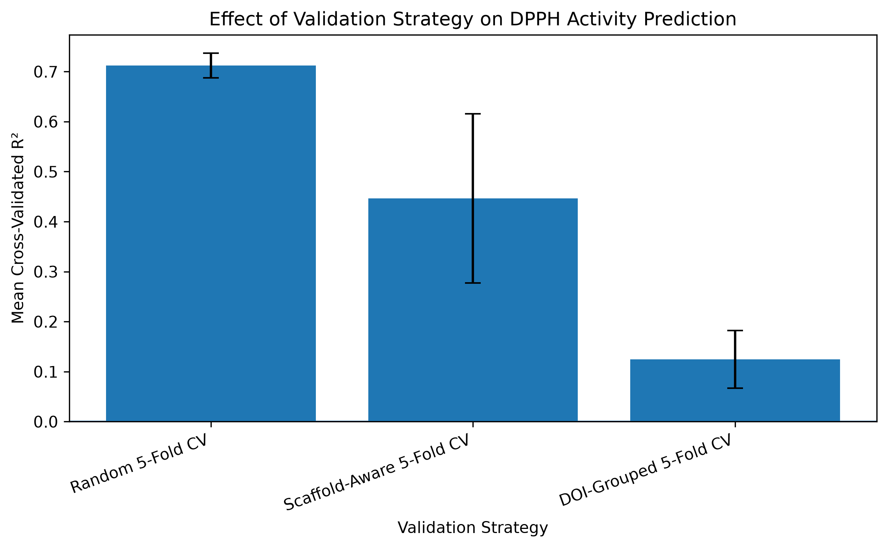

# Reliable Machine Learning for DPPH Antioxidant QSAR: Scaffold- and Study-Aware Validation with an Out-of-Domain Sulfonamide–Tyr–Gly Case Study

A cheminformatics and machine-learning study investigating molecular determinants of DPPH radical-scavenging activity, the effect of validation design on apparent QSAR generalization, and the reliability of predictions for experimentally synthesized sulfonamide–Tyr–Gly derivatives.

**Quick links:** [Main notebook](notebooks/01_dpph_qsar_analysis.ipynb) · [Figures](figures) · [Results](results) · [Data documentation](data/DATA_README.md) · [Environment](environment.yml)

---

## Validation at a Glance



*Model performance decreases substantially as validation becomes more chemically and study-aware, highlighting the difference between interpolation among familiar compounds and generalization to less familiar chemical space.*

---

## Project Overview

This project extends experimental undergraduate research on the synthesis, spectroscopic characterization, and antioxidant screening of two sulfonamide–Tyr–Gly derivatives with a computational structure–activity analysis.

The workflow combines:

- curated DPPH antioxidant activity data;
- RDKit molecular descriptors;
- 2,048-bit Morgan molecular fingerprints;
- Random Forest and Extra Trees regression;
- random, scaffold-aware, and DOI-grouped cross-validation;
- internal held-out evaluation;
- applicability-domain analysis;
- molecular-descriptor and fingerprint interpretation; and
- case-study evaluation of the experimentally investigated Tyr–Gly derivatives.

The objective is **not** to construct a peptide-specific antioxidant model. Instead, a broad small-molecule DPPH QSAR model is used to examine structure–activity relationships and to determine how reliably the experimental Tyr–Gly derivatives can be evaluated within the chemical space represented by the available modeling data.

### Research questions

1. How effectively can molecular descriptors and structural fingerprints model DPPH antioxidant activity across a broad chemical dataset?
2. How strongly does apparent model performance change when increasingly restrictive validation strategies are used?
3. Which molecular properties and fingerprint environments are statistically associated with DPPH activity?
4. How reliably can the trained model evaluate the experimentally investigated sulfonamide–Tyr–Gly derivatives?

---

## Experimental Foundation

The underlying experimental project involved the synthesis and characterization of two sulfonamide–Tyr–Gly derivatives, referred to here as **Compounds 50 and 51**.

| Compound | Reported IC50 (mg/mL) | Reported pIC50 |
|---|---:|---:|
| 50 | 0.63 | 2.850 |
| 51 | 0.74 | 2.793 |

Experimental measurements are kept distinct from computational predictions throughout the analysis.

---

## Dataset

The external modeling dataset was obtained from the repository accompanying:

**Ghironi, S., Viganò, E. L., Selvestrel, G., & Benfenati, E. (2025).**  
*QSAR Models for Predicting the Antioxidant Potential of Chemical Substances.*  
**Journal of Xenobiotics, 15(3), 80.**  
DOI: `10.3390/jox15030080`

Starting dataset:

- **1,911** DPPH-active chemical substances;
- source file: `DPPH_30min_Dataset.xlsx`.

Following assay-time filtering and molecular-structure quality control, **1,891 molecules** were retained for modeling.

### Data availability and provenance

The original third-party XLSX dataset is **not mirrored in this repository**. It remains publicly accessible from the original authors' repository:

`https://github.com/EdoardoVigano/AntioxidantActivity`

For full reproduction, download `DPPH_30min_Dataset.xlsx` from the original source and place it locally at:

```text
data/raw/DPPH_30min_Dataset.xlsx
```

Detailed provenance and reproduction instructions are provided in [`data/raw/README.md`](data/raw/README.md). The project-specific standardized Tyr–Gly case-study dataset is included at:

```text
data/processed/tyr_gly_case_study_standardized.csv
```

Generated source-derived intermediate datasets and the molecular fingerprint matrix are excluded from version control and recreated by the notebook.

---

## Molecular Representation

### Morgan fingerprints

- radius: **2**;
- fingerprint size: **2,048 bits**;
- approximately equivalent to **ECFP4**.

### RDKit molecular descriptors

Nine physicochemical descriptors were calculated:

- molecular weight;
- LogP;
- hydrogen-bond donor count;
- hydrogen-bond acceptor count;
- topological polar surface area;
- rotatable-bond count;
- aromatic-ring count;
- heavy-atom count; and
- fraction Csp3.

The combined representation contained **2,057 features**: 2,048 fingerprint bits plus 9 descriptors.

---

## Machine-Learning Models and Validation

Two ensemble tree-based regression algorithms were evaluated:

- **Random Forest Regressor**;
- **Extra Trees Regressor**.

Random Forest was retained as the primary model because Extra Trees showed the same overall validation trend without a consistent performance advantage.

| Validation strategy | Random Forest R² | Extra Trees R² |
|---|---:|---:|
| Random 5-fold CV | 0.712 | 0.737 |
| Scaffold-aware CV | 0.447 | 0.455 |
| DOI-grouped CV | 0.124 | 0.104 |

The progressive decline in performance is a central result of the study. Random splitting can place structurally related compounds or members of the same publication-derived series across training and validation folds, producing optimistic estimates of generalization. Scaffold-aware and DOI-grouped validation provide progressively more demanding tests.

---

## Internal Held-Out Test

The selected Random Forest model achieved approximately:

- **MAE:** 0.277;
- **RMSE:** 0.438;
- **R²:** 0.792.

However, performance depended strongly on structural familiarity:

| Scaffold status | Molecules | R² |
|---|---:|---:|
| Scaffold seen in training | 289 | 0.824 |
| Scaffold unseen in training | 90 | 0.580 |

The strong overall random held-out R² is therefore **not interpreted as expected performance for arbitrary novel chemical structures**.

---

## Applicability-Domain Analysis

Prediction reliability was evaluated using nearest-neighbour **Morgan fingerprint Tanimoto similarity**. A training-derived similarity threshold was used to distinguish predictions inside and outside the applicability domain.

Predictions for structurally familiar compounds were substantially more reliable than those for structurally dissimilar molecules. The analysis therefore treats a numerical prediction and the evidence supporting that prediction as separate questions.

---

## Sulfonamide–Tyr–Gly Case Study

| Compound | Reported pIC50 | Predicted pIC50 | Maximum Tanimoto similarity | Inside AD |
|---|---:|---:|---:|---|
| 50 | 2.850 | 3.857 | 0.364 | No |
| 51 | 2.793 | 3.899 | 0.333 | No |

Neither compound possessed a Bemis–Murcko scaffold represented in the external modeling dataset. Both are therefore treated as **out-of-domain case studies rather than conventional external-validation compounds**.

The model overpredicted their activities by approximately one pIC50 unit. The small predicted difference between Compounds 50 and 51 is also not considered meaningful relative to model uncertainty and their limited similarity to the training chemical space.

---

## Structure–Activity Interpretation

Descriptor-level interpretation identified several physicochemical properties associated with model predictions, including hydrogen-bond donor count, topological polar surface area, lipophilicity, fraction Csp3, and aromatic-ring content.

Morgan fingerprint interpretation identified several well-supported oxygenated aromatic environments statistically associated with increased DPPH activity within the modeling dataset.

These results are interpreted as **statistical structure–activity relationships rather than direct causal mechanisms**.

---

## Repository Structure

```text
antioxidant-qsar-tyr-gly/
│
├── data/
│   ├── DATA_README.md
│   ├── raw/
│   │   └── README.md
│   └── processed/
│       └── tyr_gly_case_study_standardized.csv
│
├── notebooks/
│   └── 01_dpph_qsar_analysis.ipynb
│
├── figures/
│   └── validation, prediction and interpretation figures
│
├── results/
│   └── model, validation, applicability-domain
│       and case-study result tables
│
├── .gitignore
├── environment.yml
├── LICENSE
└── README.md
```

---

## Reproducing the Analysis

The main computational workflow is contained in [`notebooks/01_dpph_qsar_analysis.ipynb`](notebooks/01_dpph_qsar_analysis.ipynb).

### 1. Obtain the external source dataset

Download `DPPH_30min_Dataset.xlsx` from the original authors' repository and place it at:

```text
data/raw/DPPH_30min_Dataset.xlsx
```

### 2. Create the Conda environment

```bash
conda env create -f environment.yml
conda activate antioxidant-qsar-tyr-gly
```

### 3. Launch Jupyter

```bash
jupyter notebook
```

Open `notebooks/01_dpph_qsar_analysis.ipynb`, then use **Restart Kernel → Run All Cells**.

The workflow covers raw-data loading, assay-time filtering, molecular-structure quality control, descriptor and fingerprint generation, model development, random/scaffold/DOI-grouped validation, internal held-out evaluation, applicability-domain analysis, model interpretation, Tyr–Gly case-study evaluation, figure generation, and results export.

---

## Main Outputs

The `figures/` directory contains validation-strategy comparisons, random-versus-scaffold validation, held-out prediction and residual plots, error-versus-Tanimoto analysis, and descriptor permutation importance.

The `results/` directory contains machine-readable outputs for model validation, DOI-grouped folds, held-out predictions, scaffold-specific performance, applicability-domain analysis, descriptor importance, Morgan fingerprint interpretation, and the Compound 50/51 case study.

---

## Key Findings

1. **Random validation substantially overstates generalization.** Performance decreases strongly under scaffold-aware and DOI-grouped validation.
2. **Chemical novelty reduces predictive reliability.** Unseen-scaffold performance is weaker than performance on scaffolds already represented during training.
3. **Applicability-domain assessment is essential.** Structural similarity to the training space is strongly related to prediction reliability.
4. **Compounds 50 and 51 are outside the model domain.** Their predictions are therefore interpreted cautiously rather than presented as strong external-validation evidence.

---

## Limitations

- The model is trained on a broad small-molecule DPPH dataset rather than a peptide-specific dataset.
- DPPH measurements collected across different studies may contain experimental variability.
- Random splitting benefits from structural and study-level overlap.
- Scaffold-aware and DOI-grouped validation are more demanding tests of generalization.
- Compounds 50 and 51 lie outside the identified applicability domain.
- Descriptor and fingerprint importance identify statistical associations, not direct mechanistic causation.

---

## Scientific Perspective

The central conclusion is not simply that machine learning can model DPPH antioxidant activity. Rather, **model performance and prediction reliability depend strongly on validation design, chemical similarity, and applicability-domain coverage**.

This project therefore emphasizes chemically informed validation, study-aware evaluation, applicability-domain assessment, transparent separation of experimental and predicted values, interpretable structure–activity analysis, and cautious use of machine learning for structurally novel compounds.

---

## Tools and Libraries

Python · Jupyter · RDKit · scikit-learn · pandas · NumPy · SciPy · Matplotlib · openpyxl

---

## Reference

Ghironi, S., Viganò, E. L., Selvestrel, G., & Benfenati, E. (2025). *QSAR Models for Predicting the Antioxidant Potential of Chemical Substances*. **Journal of Xenobiotics, 15**(3), 80. DOI: `10.3390/jox15030080`

---

## Author

**Dennis Obinna Orji**  
Industrial Chemistry

This repository documents the computational component of a research project combining experimental peptide chemistry, cheminformatics, and machine learning for antioxidant structure–activity analysis.
